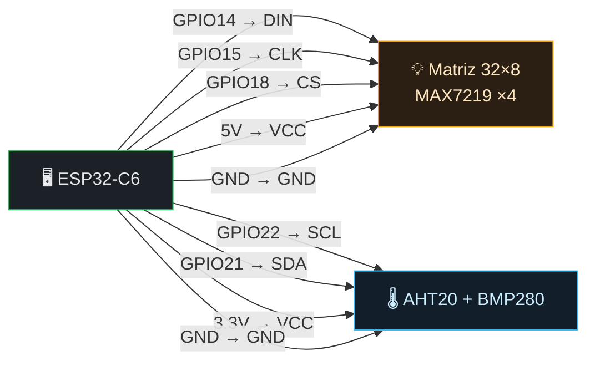

# ESP32-C6 Mini · Matrix LED

Controlador de **matriz LED 32×8** (4× MAX7219) sobre **ESP32-C6** con MicroPython.
Servidor web embebido, ~15 efectos visuales, reloj, monitor de rack (AHT20 + BMP280),
actualizaciones **OTA** y portal de configuración WiFi.

---

## ✨ Características

- **Efectos**: Matrix rain, Game of Life, reloj digital/binario, fuego, ondas, espectro, estrellas, plasma, ecualizador, laberinto.
- **Texto**: scroll, máquina de escribir, modo hacker.
- **Sprites**: sube animaciones JSON (Pac-Man, Snake, corazón, Hack the Planet).
- **Monitor de rack**: temperatura, humedad y presión en vivo.
- **Display**: brillo, contraste, flip X/Y, invertir colores.
- **OTA**: actualiza cualquier `.py` desde el navegador, con backup automático.
- **Portal WiFi**: configuración del WiFi en el primer arranque (modo AP + web).
- **UI web**: dashboard profesional con preview en vivo de la matriz.

---

## 🧰 Materiales (BOM)

| Cantidad | Componente | Notas |
|----------|------------|-------|
| 1 | **ESP32-C6** (mini / dev board) | MicroPython v1.27+ |
| 1 | **Matriz LED MAX7219 8×8** (módulo FC-16) ×4 en cascada | Forman un panel 32×8 |
| 1 | **Sensor AHT20 + BMP280** (módulo combo I2C) | Temp/humedad/presión |
| — | Cable / protoboard / jumpers | Cortos para I2C (<20 cm) |
| — | Pull-ups I2C 4.7kΩ (opcional) | Si el módulo no las trae integradas |

> Opcional: si solo quieres la matriz sin sensores, ignora la sección I2C (el código lo detecta y sigue funcionando).

---

## 🔌 Pinout

### ESP32-C6 → Matriz LED (SPI1)

| ESP32-C6 | Función | Matriz MAX7219 |
|----------|---------|----------------|
| **GPIO 14** | MOSI / DIN | **DIN** |
| **GPIO 15** | SCK / CLK | **CLK** |
| **GPIO 18** | CS / LOAD | **CS** |
| **5V (VIN)** | Alimentación LEDs | **VCC** |
| **GND** | Tierra común | **GND** |

### ESP32-C6 → Sensor AHT20+BMP280 (I2C0)

| ESP32-C6 | Función | Sensor |
|----------|---------|--------|
| **GPIO 22** | SCL | **SCL** |
| **GPIO 21** | SDA | **SDA** |
| **3.3V** | Alimentación | **VCC** ⚠️ nunca 5V |
| **GND** | Tierra común | **GND** |

> **Cascada de matrices**: las 4 módulos MAX7219 se enchufan en cadena (DIN→DOUT). Solo el primero recibe DIN/CLK/CS del ESP32; los demás se conectan entre sí.

---

## ⚡ Diagrama de cableado



```
   ┌─────────────────────┐         ┌──────────────┐      ┌──────────────┐
   │      ESP32-C6       │         │  MAX7219     │      │ AHT20+BMP280 │
   │                     │  SPI1   │  32×8 panel  │      │   (I2C)      │
   │  GPIO14 (MOSI)──────┼────────►│ DIN          │      │              │
   │  GPIO15 (SCK) ──────┼────────►│ CLK          │      │              │
   │  GPIO18 (CS)  ──────┼────────►│ CS           │      │              │
   │  5V           ──────┼────────►│ VCC          │      │ VCC ◄── 3.3V │
   │                     │  I2C0   │              │      │              │
   │  GPIO22 (SCL) ──────┼─────────┼──────────────┼──────► SCL          │
   │  GPIO21 (SDA) ──────┼─────────┼──────────────┼──────► SDA          │
   │  GND          ──────┼────────►│ GND          │      │ GND          │
   └─────────────────────┘         └──────────────┘      └──────────────┘
```

---

## 🚀 Puesta en marcha

### Opción A — Flashear firmware (recomendado para usuarios finales)
1. Flashea MicroPython en el ESP32-C6 (web flasher en [espressif.github.io](https://espressif.github.io/esptool-js/) o `esptool.py`).
2. Sube el código:
   ```bash
   pip install -r requirements.txt   # rshell / mpremote
   ./upload.sh                        # auto-detecta el puerto
   ```
3. Copia tu configuración WiFi:
   ```bash
   cp led_matrix_project/config.example.txt led_matrix_project/config.txt
   # edita config.txt con tu SSID/PASSWORD
   ./upload.sh
   ```
4. Abre la IP que imprime la consola (ej. `http://192.168.0.137`).

> Sin `config.txt`, el dispositivo arranca en modo AP `MatrixLED-Setup`. Conéctate y configúralo desde `192.168.4.1`.

### Opción B — Web UI
Una vez en marcha, abre la IP desde el navegador. Todo se controla desde ahí:
efectos, texto, display, animaciones, monitor de rack y OTA.

---

## 🔁 OTA (actualizaciones remotas)

Desde la web UI → tarjeta **OTA Updates**:
1. Selecciona un archivo `.py` → **Upload Python**.
2. Se valida la sintaxis automáticamente (si falla, no se toca el original).
3. Se crea un **backup** automático (`backups/archivo.py.bak_FECHA`).
4. Pulsa **Restart device** para aplicar.

**Seguridad**: valida sintaxis, límite 500 KB, anti path-traversal, máximo 5 backups por archivo.

---

## 🩺 Solución de problemas

| Síntoma | Causa probable | Solución |
|---------|----------------|----------|
| Sensor devuelve `null` | Fallo I2C (`ENODEV`) | VCC a **3.3V** (no 5V), pull-ups 4.7kΩ, cables cortos, freq. ya reducida a 50 kHz |
| No aparece la IP | WiFi no conectada | Entra en modo AP `MatrixLED-Setup` y reconfigura |
| Pantalla con ruido eléctrico | Brillo alto con muchos LEDs | El código ya limita brillo; usa VCC estable |
| No arranca tras OTA | Error en código subido | Restaura backup por REPL: `mpremote cp backups/x.bak :/x.py` |

**Escaneo I2C de diagnóstico** (por REPL):
```python
from machine import I2C, Pin
print(I2C(0, scl=Pin(22), sda=Pin(21)).scan())  # [56, 118] = [0x38, 0x76]
```

---

## 📁 Estructura

```
led_matrix_project/
├── main.py                  # Arranque: WiFi, rutas HTTP, bucle de efectos
├── webserver.py             # Servidor HTTP + UI dashboard
├── display.py               # Wrapper de la matriz (flip/invert/contraste)
├── max7219.py               # Driver MAX7219 (mcauser)
├── effects.py               # Todos los efectos visuales
├── sensor_aht20_bmp280.py   # Driver AHT20 + BMP280 (I2C)
├── config.txt               # SSID/PASSWORD (¡no se commitea!)
├── config.example.txt       # Plantilla de configuración
├── settings.json            # Estado persistente (auto-generado)
├── fonts/                   # Fuentes bitmap
├── drawings/                # Sprites JSON de ejemplo
├── static/style.css         # Estilos de la UI
└── backups/                 # Backups de OTA (auto-generado)
```

## 🔧 Configuración (`config.txt`)

```ini
SSID=tu_red_wifi
PASSWORD=tu_password
WEB_PASSWORD=             # opcional: protege la UI (HTTP Basic Auth)
```

---

## 👥 Créditos

- Driver MAX7219: [mcauser/micropython-max7219](https://github.com/mcauser/micropython-max7219) (MIT)
- 0x7EA · idiotsandwich.club · v3.0
